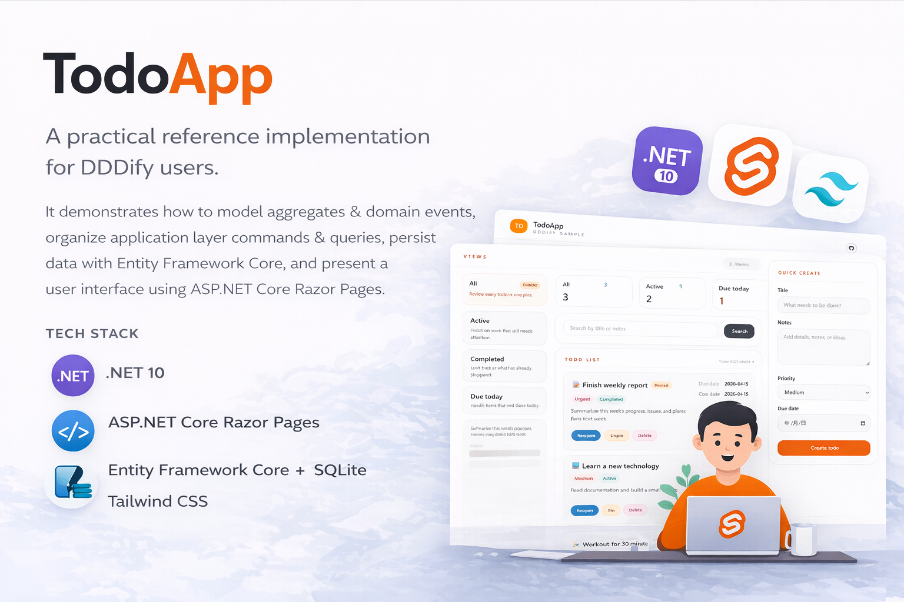

# Samples

<p align="center">
  
</p>

## Overview

This directory contains the official sample applications for `Dddify`. The current sample, `TodoApp`, is a practical reference implementation that shows how to build a layered Domain-Driven Design application with clear separation between domain logic, application use cases, infrastructure concerns, and the web UI.

## Tech Stack

- .NET 10
- ASP.NET Core Razor Pages
- Entity Framework Core + SQLite
- Tailwind CSS

## What This Sample Shows

- A four-layer architecture: `Domain`, `Application`, `Infrastructure`, and `Web`
- Aggregate-centric modeling around the `Todo` workflow
- Commands, queries, DTOs, validators, and domain event handlers
- Repository and `DbContext` integration with a unit-of-work setup
- A simple, production-friendly Razor Pages UI

## Project Structure

```text
samples/
|- TodoApp.Domain/          # Domain model, aggregates, domain events, repository contracts
|- TodoApp.Application/     # Commands, queries, DTOs, validators, application handlers, service interfaces
|- TodoApp.Infrastructure/  # EF Core persistence, repositories, services, migrations
|- TodoApp.Web/             # Razor Pages frontend, composition root, static assets
```

## Architecture Notes

The sample follows a classic DDD layering style:

- `TodoApp.Domain` contains the core business model. It is also the layer that directly references `Dddify`, while the other layers consume those shared building blocks through normal project references.
- `TodoApp.Application` coordinates use cases through commands and queries, returns DTOs to the presentation layer, and handles application-level workflows.
- `TodoApp.Infrastructure` implements persistence with EF Core and SQLite, wires repositories, and provides supporting services.
- `TodoApp.Web` is the entry point, configures `Dddify`, and renders the UI with Razor Pages.

## Getting Started

### Prerequisites

- .NET 10 SDK

### Run Locally

From the repository root:

```bash
dotnet run --project samples/TodoApp.Web/TodoApp.Web.csproj
```

The app uses SQLite by default, with the database file configured in `samples/TodoApp.Web/appsettings.json`:

```json
"ConnectionStrings": {
  "Default": "Data Source=TodoApp.db"
}
```

### Build the Sample

```bash
dotnet build samples/TodoApp.Web/TodoApp.Web.csproj
```

## Scope and Limitations

`TodoApp` is best treated as an onboarding sample: small, focused, and easy to explore. Since the sample currently centers on a single domain aggregate, it does not fully demonstrate the strengths of DDD when handling more complex business logic.
